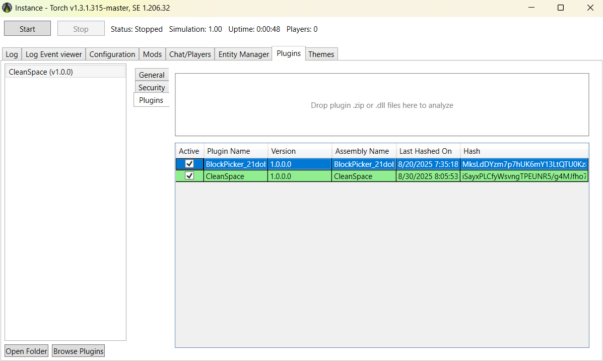
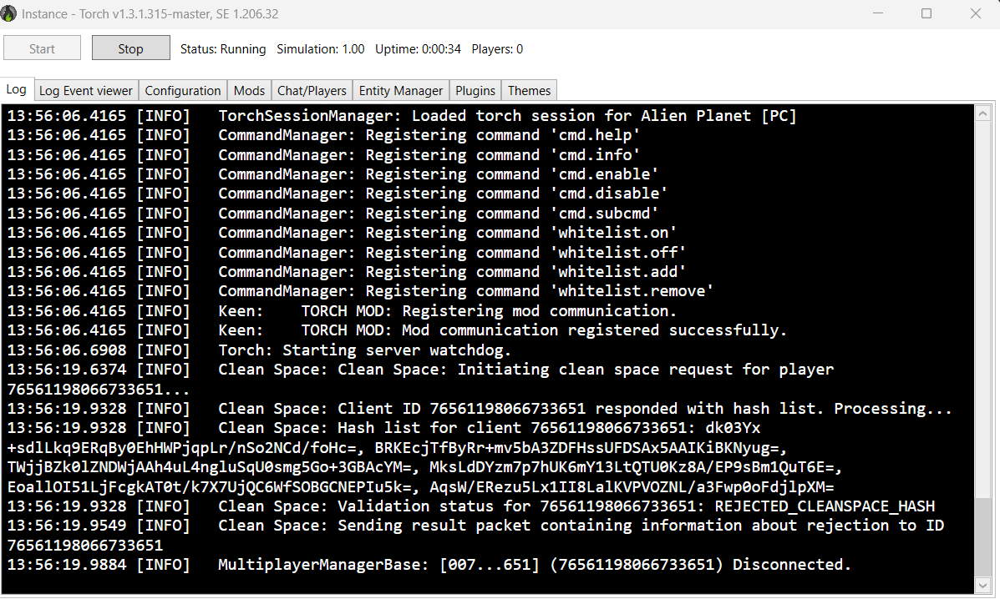
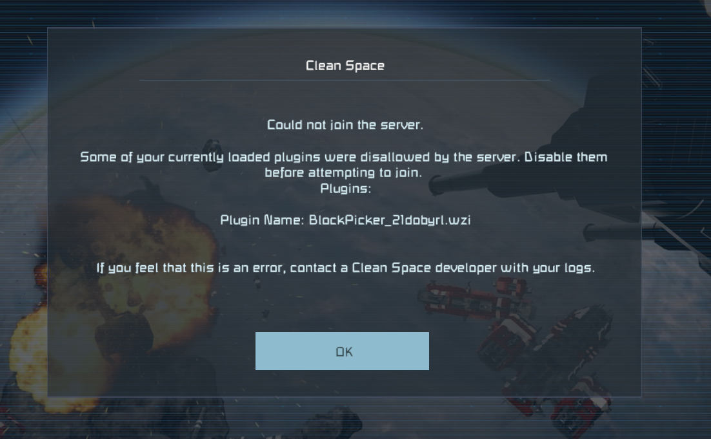
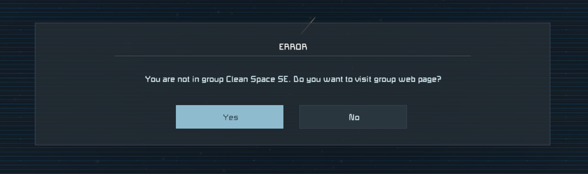
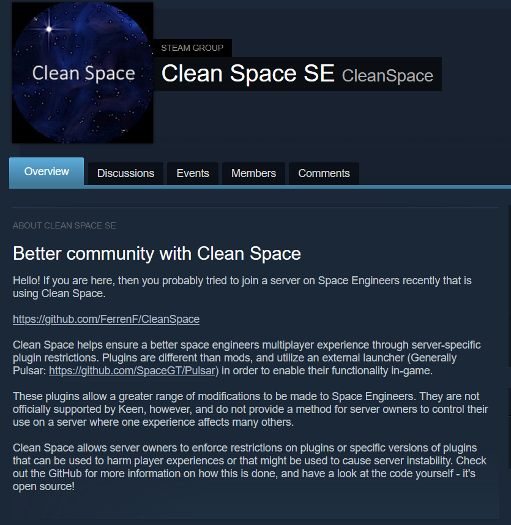
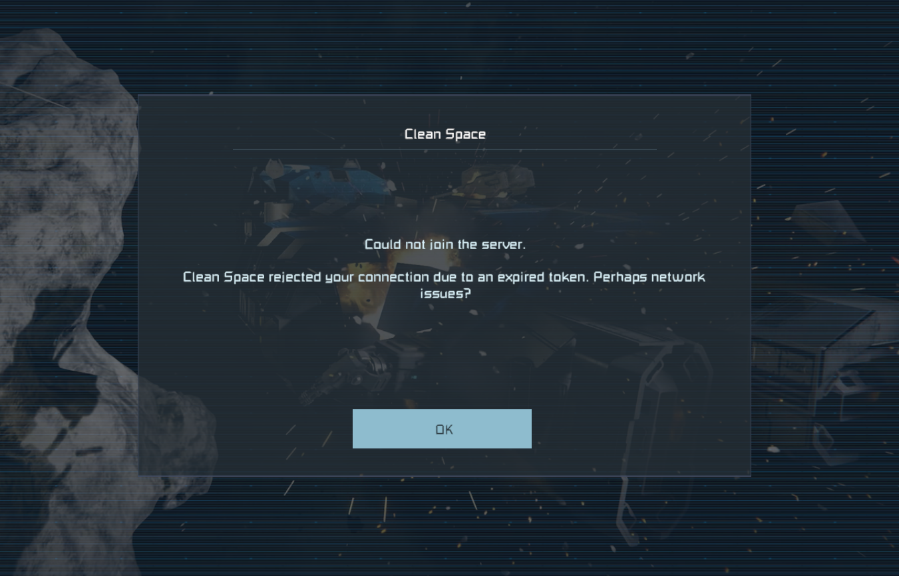
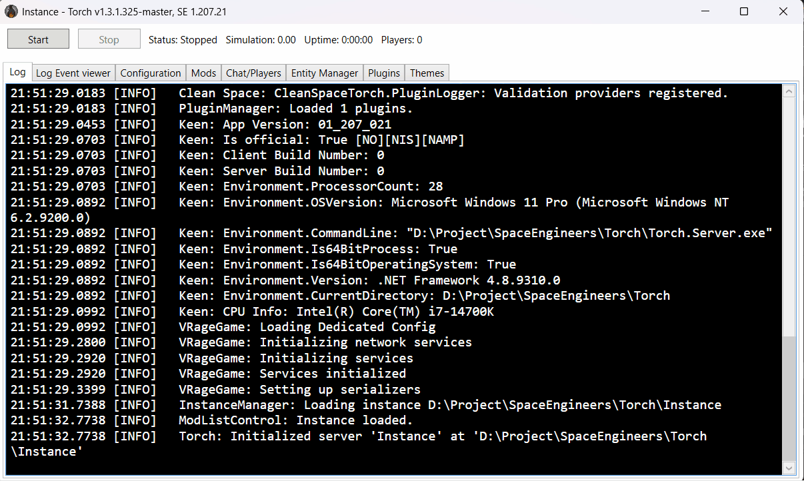

# Clean Space: A cleaner Space Engineers multiplayer experience.

Space Engineers is a sandbox game with near limitless potential and a creative and intelligent community to go along with it. With a little jank and some friends, you can turn your dreams of space battles and bases to reality.

One of the best parts of Space Engineers is it's moddability. While limited in function, Space Engineers boasts the use of C# syntax and compilation in-game to provide logic and customization to player blocks, the character itself, the heads-up display.. you get it. Outside of in-game scripting, Keen has
provided us with a more powerful modding API to make the creation of custom game content and overhauls possible.

Finally, and while Keen has officially dropped support for them, there exists the ability to modify the game from externally loaded code (Assemblies) using tools such as PluginLoader and Pulsar. These types of modifications have no limit. They can do anything you can make a custom program do on a computer with full rights. This is where we start to run into problems.

One of the implications of being so powerful is the ability to bypass intended gameplay in order to gain an intended or unintended unfair advantage over another player, or to outright harm a player experience with malicious intent. These plugins already exist. 

Server owners have very little enforcement ability over disallowing or allowing plugins. If you load a client side plugin, there is no direct way for the server to tell that you have done so. As you can imagine, this unfortunate fact means that the fairness of anyone's experience on a multiplayer server is entirely dependent upon the goodwill and good nature of other players.

That is not always acceptable, and certainly not acceptable in terms of something with as much power over gameplay as plugins. But what can we do?
  

Clean Space seeks to change change that.  

## What is Clean Space?

Clean space is a client and server plugin for Space Engineers designed to allow server owners to enact controls on the use of plugins from clients. It can be configured as a whitelist or blacklist with adjustable conflict behavior. It supports dedicated servers using Torch API to manage their instance.

## What does it do?

When Plugin Loader/Pulsar is loaded alongside Space Engineers, it allows the former to inject the external programs that we know as plugins into the game. The game readily accepts these plugins and the plugin loader iteself because the engine was created with interfaces that are made tofacilitate this, by Keen. 

Clean Space identifies these plugins by reading the same space that Plugin Loader injects these assemblies into. By fingerprinting the internal structure of plugins at the byte level, Clean Space uniquely and distinctly identifies each version of all plugins that are currently loaded into the game. A list of these signatures is sent during a conversation facilitated by Clean Space while connecting to the server, before the client even begins to load the world.

The chart below explains in more detail what is happening when a client connects to a server guarded by Clean Space.
https://github.com/FerrenF/CleanSpace/wiki/Validation-Flow

On the server side, Clean Space sits inbetween players attempting to connect to your server and adds an extra step to the process. During initial connection,
Clean Space will ask the player's client for a conversation. During this conversation, information about eh integrity of the client and the currently installed plugins are exchanged. Clean Space compares this information that the client provides to information stored server-side to determine whether a player can complete the connection to the server or not.

## Does Clean Space look on my hard drive?

No. Clean Space operates only within Space Engineer's memory region while running. It does not scan for plugins in the filesystem where it is installed.

## Do clients have to use the plugin?

It depends. If you set up Clean Space to deny connections on conflict, then all of your players will need the client-side Clean Space plugin to connect.
If they do not have clean space, then they will be disconnected after a timeout and then directed to a steam group including information about Clean Space, what it is, and where to get it.

## What's stopping me from ...X?

The code is open source, and if you feel like you can circumvent it you are welcome to try. If you manage to, sharing makes a better Space Engineers =). Otherwise, forging any part of a Clean Space request is difficult. Take a look at the diagram.

Clean Space will verify it's own integrity in a way that the client CANNOT anticipate. Any modifications to any part of Clean Space run the risk of being flagged. 
  

# Setup 

Clean Space is VERY easy to setup on your server. It is a normal Torch Plugin with a GUI available in the plugins menu. Here's a quick ocular guide in lieu of me writing any more for right now.

# Warnings:

This plugin is in development and is in it's infancy just past the proof-of-concept stage. Do not try to use this 'production' on a high traffic server. I will not provide support currently if you do and you do so at your own risk.

Feel free to give it a spin on a private instance.

# Other:

Want to contribute? Brave Soul, hit me up on discord. If you are not an experienced developer, though, there probably won't be a ton for you to do.